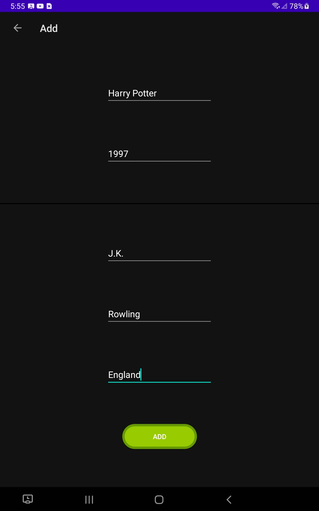
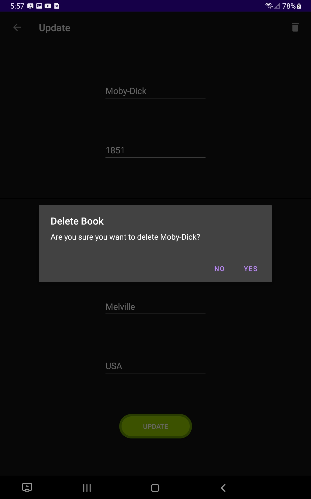
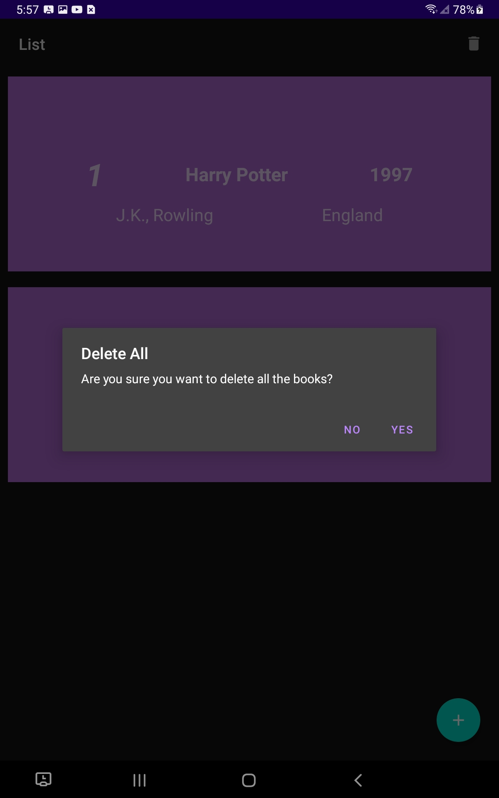
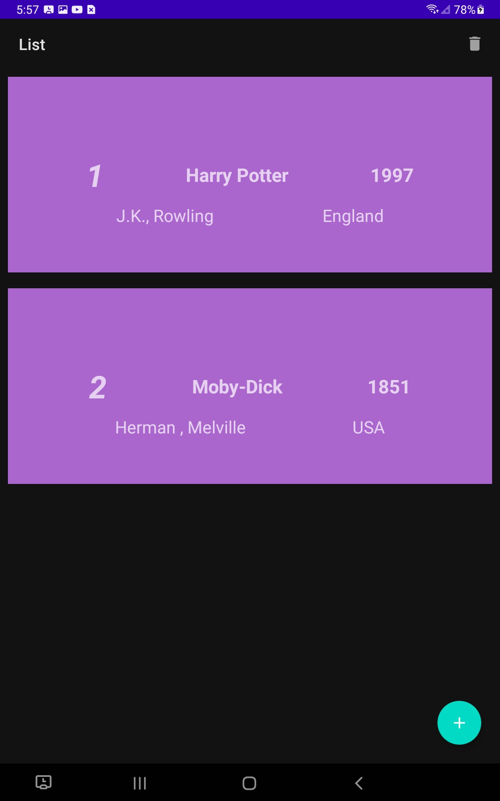
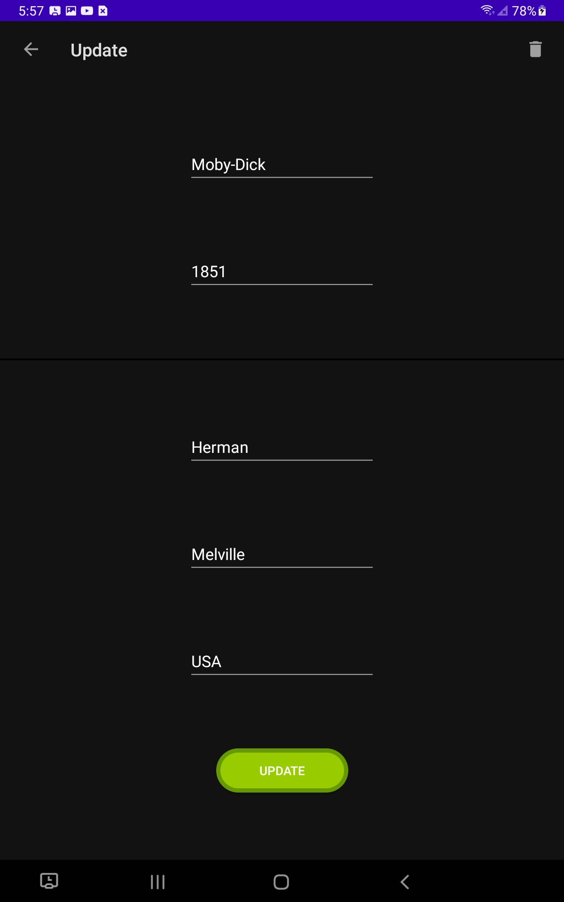

# Book-Room-Database

THIS PROJECT SHOWS HOW TO USE ROOM DATABASE WITH FLOW, LIVE DATA, AND VIEWMODEL

This project is a book database that uses CRUD functionality. Hopefully this project is of help to those that need to write a project using Room. 

